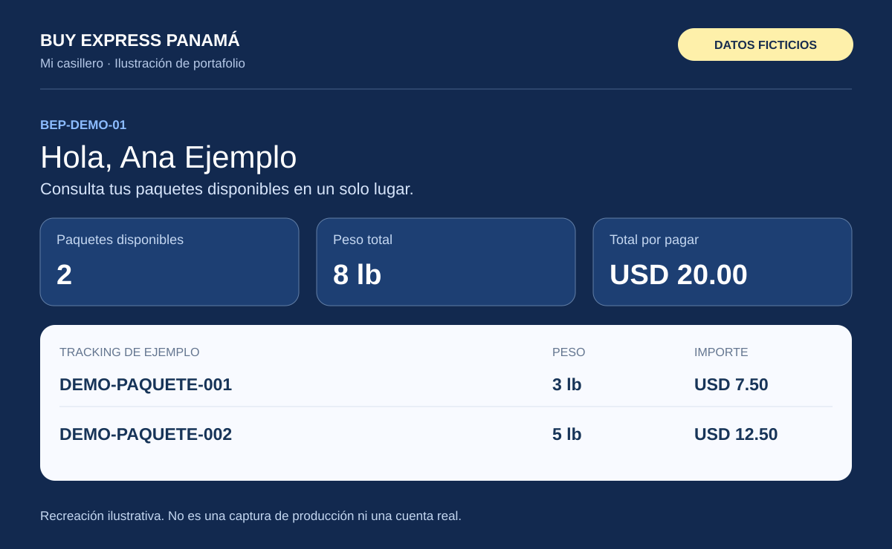
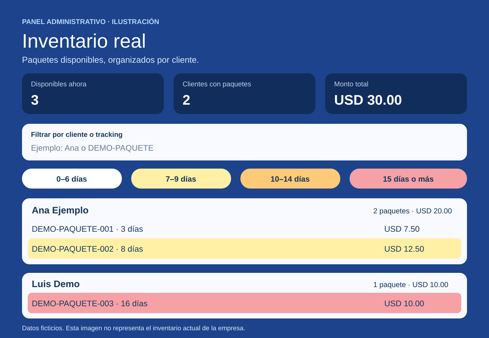

# Buy Express Panamá · Portal de clientes e inventario

Caso de estudio de una plataforma web para consultar paquetes y apoyar la operación de una empresa de casilleros y logística en Panamá.

**Creador e impulsor del portal y autor del caso de estudio:** [Víctor Calderón](https://github.com/victorgcalderona-rgb)  
**Tipo de proyecto:** solución aplicada a una operación real, desarrollada con apoyo de inteligencia artificial.  
**Alcance de este repositorio:** documentación e imágenes ilustrativas; no contiene el código del sistema de producción ni información de clientes.

## El problema

Los clientes necesitaban una forma sencilla de saber cuántos paquetes tenían disponibles, sin depender exclusivamente de buscar cada tracking. Por su parte, el equipo administrativo necesitaba consultar el inventario físico, organizar los paquetes por cliente y distinguir los que llevaban más tiempo en oficina.

La información operativa se gestionaba en Microsoft Access. El reto fue llevar parte de esa información a una experiencia web comprensible para clientes y administradores, manteniendo separados los registros generales y el inventario real.

## La solución

Se desarrolló un portal con dos experiencias:

- **Clientes:** consulta por tracking y acceso a «Mi casillero» mediante un código BEP asociado al número de cliente, con contraseña propia. El cliente puede revisar sus paquetes disponibles, su peso y el total por pagar.
- **Administración:** inventario real organizado por cliente, búsqueda por nombre o tracking, resumen de importes y filtros por antigüedad. La sección puede minimizarse dentro del panel.

Un proceso de sincronización conecta los datos operativos de Access con el portal. Las listas de paquetes visibles para los clientes se basan en el inventario real.

## Vista ilustrativa del portal de clientes

*Recreación para este portafolio, no una captura de producción. Todos los nombres, códigos, tracking e importes son ficticios.*

## Vista ilustrativa del inventario

*Recreación para este portafolio. No representa el inventario actual de la empresa.*

## Funciones implementadas

| Área | Función |
| --- | --- |
| Consulta pública | Búsqueda de disponibilidad por tracking. |
| Portal de clientes | Acceso con código BEP y contraseña; resumen de paquetes, peso e importe. |
| Creación de contraseña | Mostrar u ocultar contraseña y aviso cuando la confirmación no coincide. |
| Administración | Inventario real, agrupación por cliente y suma de importes. |
| Búsqueda | Filtro por nombre de cliente o tracking. |
| Antigüedad | Rangos de 0–6, 7–9, 10–14 y 15 días o más, con colores y botones de filtro. |
| Gestión de acceso | Reinicio de contraseñas desde la administración. |
| Integración operativa | Sincronización de datos desde Microsoft Access. |
| Avisos | Flujo administrativo de solicitudes y avisos asociados a paquetes. |

## Tecnología

- **Interfaz:** React y TypeScript.
- **Aplicación web:** estructura compatible con Next.js, ejecutada con Vinext/Vite.
- **Datos del portal:** Cloudflare D1.
- **Origen operativo:** Microsoft Access y un proceso de integración en Node.js.
- **Publicación:** Sites.

No se incluye en este repositorio la configuración de despliegue, la base de datos ni las credenciales de integración.

## Creador del proyecto: de la necesidad a la solución

Ideé y creé este portal al identificar la necesidad de los clientes de consultar sus paquetes de forma sencilla y mejorar su interacción con la empresa.

Transformé esa necesidad en una solución digital: definí las funcionalidades, los flujos de uso y la experiencia del cliente, y dirigí su implementación con apoyo de herramientas de inteligencia artificial. Realicé pruebas con casos reales y ajustes para facilitar su uso en computadoras y teléfonos móviles.

La idea, la iniciativa y la dirección del proyecto fueron mías. La IA fue una herramienta de apoyo para implementar, revisar y ajustar la solución; no se presenta como una implementación escrita íntegramente sin asistencia.

## Aprendizajes

- Identificar a un cliente y asociar correctamente sus paquetes son problemas diferentes: el acceso no basta si el inventario no está vinculado al cliente correcto.
- Un registro general no equivale necesariamente a un paquete físicamente disponible. La vista del cliente debe reflejar el inventario real.
- La sincronización debe contemplar altas, cambios, entregas y bajas. Una sincronización que solo envía cambios presentes puede dejar registros antiguos en la web.
- En pantallas pequeñas, controles como «Mostrar contraseña» necesitan espacio propio para no tapar el campo.
- Los textos claros y las guías paso a paso son importantes para clientes con poca experiencia digital.

## Estado y límites

El portal y el panel administrativo han sido implementados y utilizados en la operación. Este caso de estudio describe sus funciones; **no es una auditoría de seguridad ni una certificación de disponibilidad**.

No se aportan métricas verificadas de ahorro de tiempo, crecimiento o uso, por lo que no se atribuyen mejoras porcentuales.

### Google Wallet: prototipo en pruebas

También se exploró una tarjeta de fidelización en Google Wallet. La propuesta contempla acumular libras desde el lanzamiento del programa y otorgar 3 lb de beneficio por cada 100 lb pagadas y entregadas. Existe una tarjeta de prueba; **no se presenta como un programa de fidelización lanzado ni como una integración de producción terminada**.

### Trabajo pendiente

- Completar y validar la detección automática de bajas del inventario de Access. Se habilitó una eliminación web puntual autenticada, pero eso no equivale a sincronizar automáticamente todas las bajas.
- Fortalecer la validación de identidad inicial y revisar el sistema de acceso antes de ampliar su uso.
- Medir resultados con indicadores reales.
- Preparar, si se decide compartir código, una demostración aislada con datos sintéticos.

## Privacidad y uso del material

Este repositorio contiene únicamente documentación e ilustraciones creadas para el portafolio. No incluye datos personales, archivos de Access, claves de Google Wallet, contraseñas, tokens, enlaces de administración ni código de producción.

La identidad comercial se utiliza para describir el proyecto. El material no otorga derechos sobre la marca ni constituye una versión descargable del sistema. Antes de hacer público el repositorio, debe confirmarse la autorización de la empresa para presentar su nombre.

## Cómo explorar este caso de estudio

No requiere instalación: basta con leer este documento y abrir las ilustraciones. No hay una cuenta de demostración conectada a datos reales.
